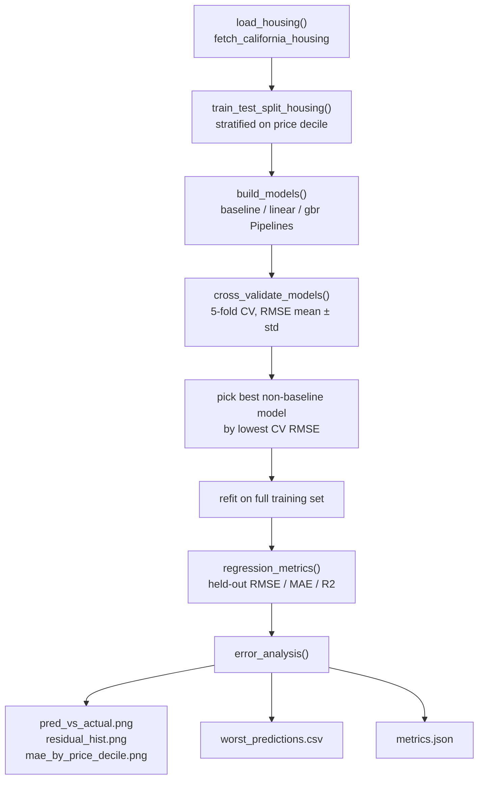
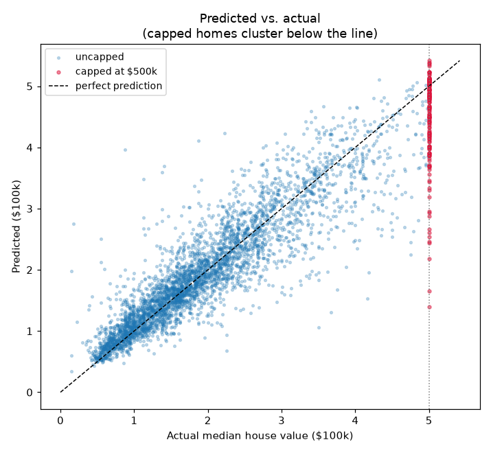
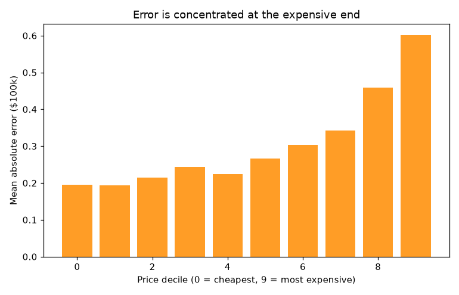

# California Housing — Regression with Error Analysis

> **AI Engineer Roadmap — Project 1.1**
> *Teaches: scikit-learn, the ML workflow, why a baseline matters.*
> *Done when: you can explain why your model is wrong on the cases it gets wrong.*


A complete classical-ML regression workflow on the California Housing dataset
(20,640 census block groups; predict median house value). It runs the *whole*
loop — reproducible split, a baseline, feature engineering, cross-validation,
held-out evaluation — and then does the part most tutorials skip: **explains the
model's failures**.

---

## What it does

`train.py` runs one command that:

1. Loads the California Housing data (fetched from scikit-learn's dataset
   mirror on first run, cached locally afterwards — see [Limitations](#limitations)).
2. Splits it into train/test, stratified on price deciles so the heavy right
   tail (including the censored top) is represented in both splits.
3. Cross-validates three models (baseline, linear, gradient boosting) with
   5-fold CV.
4. Refits the best model on the full training set and evaluates it on the
   held-out test set.
5. Runs an error analysis: which rows the model gets wrong, and *why*, with
   figures and a machine-readable report written to `reports/`.

## Architecture



Feature engineering (`bedrooms_per_room`, `rooms_per_person`,
`population_density`, `log_median_income`) is wrapped in a
`FunctionTransformer` and lives *inside* each model's `Pipeline`, so it is
fit fresh on every CV training fold — no leakage into the cross-validation
estimate.

## Quickstart

```bash
python -m venv .venv && source .venv/bin/activate   # Win: .\.venv\Scripts\activate
pip install -e ".[dev]"
python train.py        # runs the full loop, writes reports/
pytest -q              # 10 tests
```

`train.py` accepts `--output-dir` (default `reports`) and `--no-save-model`
(skip writing the fitted pipeline to `reports/model.joblib`).

## Results

5-fold cross-validation on the training set (RMSE, in units of $100k):

| Model | CV RMSE | vs. baseline |
| --- | ---: | --- |
| `baseline` (predict the mean) | 1.155 | — |
| `linear` (engineered features + scaling) | 0.673 | 42% better |
| **`gbr`** (HistGradientBoosting) | **0.455** | **61% better** |

Held-out **test** performance of the chosen model (`gbr`):

| RMSE | MAE | R² |
| ---: | ---: | ---: |
| 0.462 | 0.304 | 0.838 |

The baseline exists to make these numbers mean something: a model that couldn't
beat 1.155 would have learned nothing. `gbr` cuts error by ~60%.

---

## Why the model is wrong where it's wrong

This is the heart of the project. The error is **not** spread evenly — it is
concentrated, and for an *explainable* reason.

### 1. The target is censored at $500k (the dominant failure mode)

`MedHouseVal` was capped at 5.0 ($500k) when the data was collected: every home
worth more was recorded as exactly 5.0. The true value is **unknowable**, so the
model can only under-predict these rows.

| | Capped rows (≥ $500k) | Uncapped rows |
| --- | ---: | ---: |
| Share of test set | 4.4% | 95.6% |
| MAE | **0.581** | 0.292 |
| Mean residual (pred − actual) | **−0.511** | ~0 |

So **4.4% of rows produce 8.5% of the total absolute error**, and they are
systematically *under*-predicted (mean residual −0.51). This is a data
limitation, not a modelling bug — and being able to say that precisely is the
point.



The capped homes (crimson) sit in a vertical wall at x = 5.0, all *below* the
diagonal — the model correctly thinks they're expensive but can't go high enough.

### 2. Error grows with price



The cheapest 80% of homes are predicted well; error climbs steeply in the top
two deciles. Expensive homes are rarer (less signal) *and* include the capped
ceiling, so both effects stack.

### 3. The individual worst misses are interpretable

`reports/worst_predictions.csv` lists the 10 largest errors. Reading them:

- **7 of 10 are capped homes** (`actual = 5.0`) the model under-predicts — the
  same story as above.
- One row has `AveRooms = 141.9` with a population of 30 — a near-empty census
  block where the per-household averages are meaningless. That's a **data
  anomaly**, not a model failure.
- A couple are genuine surprises (e.g. a cheap home in central San Francisco the
  model expects to be pricey) — the residual local effects no tabular feature
  captures.

**Takeaway:** the model's errors decompose into (a) censored targets it cannot
fix, (b) a handful of corrupt rows, and (c) irreducible local noise — *not*
random incompetence. That's the difference between "I trained a model" and "I
understand my model."

---

## Project structure

```
src/housing/
├── __init__.py   # public API re-exports for `import housing`
├── data.py       # load + reproducible, price-stratified train/test split
├── features.py   # engineered ratios/log as a pipeline-safe transformer
├── model.py      # baseline + linear + gbr pipelines; K-fold CV
└── evaluate.py   # metrics, residual diagnostics, error analysis + figures
train.py          # wires the full loop into one command
tests/            # 10 pytest tests (features, metrics, split, end-to-end)
reports/          # committed figures, metrics.json, worst_predictions.csv
```

## Key design decisions

- **Feature engineering lives inside the `Pipeline`**, so it is fit only on each
  training fold during cross-validation — no data leakage into the CV estimate.
- **Stratified split** on price deciles, so train and test share the same price
  distribution (including the capped tail).
- **A real baseline** (`DummyRegressor`) is a first-class model, not an
  afterthought — every candidate must clear it before being taken seriously.
- Engineered features (`bedrooms_per_room`, `rooms_per_person`,
  `population_density`, `log_median_income`) encode ratios and the diminishing
  effect of income — things a linear model can't find alone.
- Figures and reports are generated with a headless matplotlib backend so
  `train.py` runs unattended in CI or any no-display environment.

## Limitations

- The target's $500k censoring is a property of the 1990 census data itself —
  no amount of modelling can recover the true value of capped rows; the best
  a model can do is flag them (which the error analysis does).
- The dataset is **not bundled** with scikit-learn — `fetch_california_housing`
  downloads it from a remote mirror the first time it runs and caches it under
  `~/scikit_learn_data/`. A network connection is required once; subsequent
  runs use the cache.
- `gbr`'s hyperparameters (`learning_rate`, `max_iter`, `max_leaf_nodes`,
  `l2_regularization`) were chosen once and are not tuned by a search — there
  is headroom left on the table in exchange for a simple, fast, reproducible
  script.
- This is a training/analysis script, not a service: there is no inference
  API, no model versioning beyond the (gitignored) `reports/model.joblib`,
  and no CI currently runs the test suite automatically.

## Roadmap

- [ ] GitHub Actions workflow to run `pytest -q` on every push/PR.
- [ ] Hyperparameter search (e.g. `RandomizedSearchCV`) for the `gbr` model.
- [ ] A small inference CLI/notebook that loads `reports/model.joblib` and
      scores new rows.
- [ ] Dependency pinning/lockfile so the published CV numbers stay
      reproducible as scikit-learn/pandas evolve.

## License

MIT. Dataset is fetched from scikit-learn's dataset mirror on first run
(1990 US Census data, public domain) and cached locally.
